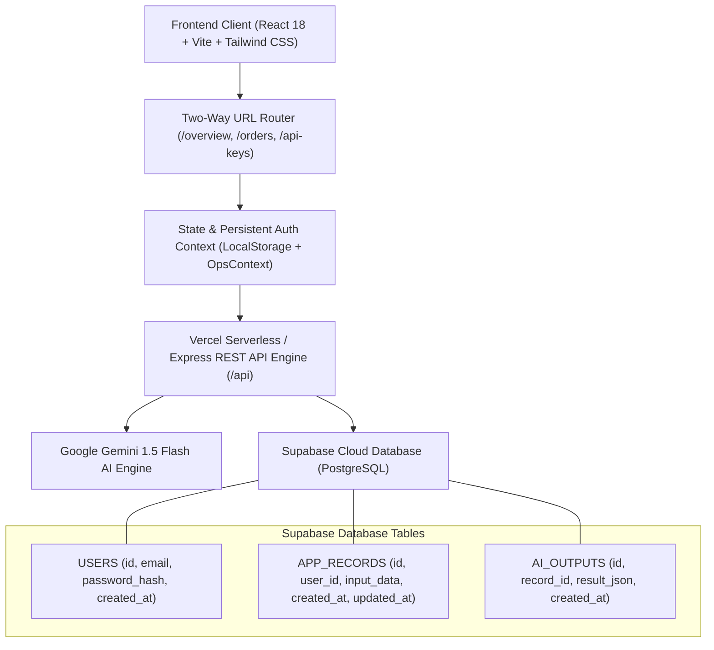

# OPSpulse — Autonomous Enterprise Operations Intelligence Engine

> **Real-Time Cross-Departmental Operations Intelligence, Autonomous Risk Mitigation & AI Decision Support System**

---

## 1. Project Name
**OPSpulse (Enterprise 4.5 PRO)**  
*Live Production URL*: [https://enterprise-ai-5mzs.vercel.app](https://enterprise-ai-5mzs.vercel.app)  
*Cloud Database*: [https://vcwqdvgibvtnktdfhipa.supabase.co](https://vcwqdvgibvtnktdfhipa.supabase.co)

---

## 2. Problem
Modern mid-to-large enterprise businesses face severe operational fragmentation:
- **Departmental Silos**: Sales, Finance, Inventory, Operations, and Logistics operate in isolated software tools (ERP, WMS, CRM, Spreadsheets), leading to delayed handoffs and blind spots.
- **Undetected Stock Discrepancies**: Physical warehouse shortages (e.g. Order #1042 with a 36-unit physical deficit) are discovered only during packing, causing costly delivery delays and SLA penalties.
- **Approval Bottlenecks**: High-value commercial orders sit in finance queues for an average delay of 8.7+ hours due to manual approval chains.
- **Lack of Autonomous Mitigation**: Traditional dashboards only display lagging static charts without offering proactive resolution workflows.

---

## 3. Solution
**OPSpulse** provides an autonomous, real-time command center that continuously streams telemetry across all 5 operational departments:
- **Proactive Risk Sentinel**: Real-time discrepancy detection engine identifying delivery hazards and SLA breaches before they impact customers.
- **1-Click Autonomous Mitigation Wizard**: Multi-stage resolution engine that transfers buffer stock from Hub South (Warehouse C) to Warehouse B with live inventory rebalancing.
- **PulseBot AI Copilot & Voice Briefing**: Google Gemini 1.5 Flash AI integration providing instant root-cause diagnostics, executive daily briefs, and natural language decision support.
- **Persistent Cloud State Synchronization**: Live PostgreSQL database on Supabase tracking users, operations records, and AI inferences with zero data loss.

---

## 4. Features

1. **Executive Operational Command Center**: Multi-department health telemetry, real-time active order pipeline, and critical attention alerts.
2. **Incident Deep-Dive & Barcode Audit**: Diagnostic view of Order #1042 (ABC Industries, ₹2,40,000) showing confirmed vs physical inventory discrepancy with CSV verification.
3. **1-Click Mitigation Wizard**: Interactive 4-step autonomous buffer transfer protocol with real-time progress animation and status execution.
4. **PulseBot Mascot & AI Copilot**: Floating interactive assistant powered by Google Gemini AI with voice speech synthesis and instant answers.
5. **Executive Audio Briefing Studio**: Synthesized speech intelligence report with dynamic audio waveform visualizer.
6. **Task & SLA Countdown Engine**: Real-time SLA countdown timers with priority escalations (Critical / High) and 1-click reassignment.
7. **Bottleneck Intelligence Matrix**: Queue depth analysis and latency trackers across Finance, Logistics, and Inventory.
8. **Unique URLs & Full History Navigation**: Every single view (`/overview`, `/orders/ORD-1042`, `/analytics`, `/records`, `/api-keys`) has a distinct URL with native browser back/forward history.
9. **Developer & API Keys Portal (`/api-keys`)**: 1-click cURL code generator and API key viewer for judges and developers.
10. **Database Records Live Viewer (`/records`)**: Live CRUD management for `APP_RECORDS` and `AI_OUTPUTS` in Supabase.
11. **Mobile-Native Responsive UI**: Slide-out drawer, bottom navigation bar, and thumb-friendly touch targets.
12. **Role-Based Perspectives**: Instant role switcher between *Executive / Manager*, *Department Head*, and *Operations Specialist*.

---

## 5. Architecture



---

## 6. Tech Stack

- **Frontend**: React 18, Vite, Vanilla CSS + Tailwind CSS, Framer Motion, Lucide React, Recharts, Canvas Confetti.
- **Backend API**: Node.js, Express.js, REST API Architecture, Vercel Serverless Functions.
- **Database & Cloud**: Supabase (PostgreSQL), Row Level Security (RLS), UUID keys.
- **Artificial Intelligence**: Google Gemini 1.5 Flash Model, Prompt Engineering, Structured Operational Reasoning.
- **Deployment & Hosting**: Vercel (Production CI/CD), GitHub.

---

## 7. AI Integration

OPSpulse uses **Google Gemini 1.5 Flash** to power its decision support engine:
- **Endpoint**: `POST /api/ai` and `POST /api/ai/ask-operations`
- **Context Telemetry**: Live operational feeds (Order #1042 stock deficit, 18 finance queue delays, David Chen SLA countdown) are injected into Gemini prompts.
- **Auto-Persistence**: Every AI prompt is logged into `APP_RECORDS` and the resulting structured diagnosis is persisted into `AI_OUTPUTS` linked by `record_id`.
- **Fallback Engine**: Resilient rule-based operational reasoning ensures uninterrupted decision support if external network latency occurs.

---

## 8. Database Schema (Supabase PostgreSQL)

```text
USERS
 ├── id (UUID, Primary Key)
 ├── email (TEXT, Unique)
 ├── password_hash (TEXT, SHA-256 Hashed)
 ├── name (TEXT)
 ├── role (TEXT)
 ├── department (TEXT)
 └── created_at (TIMESTAMPTZ)

APP_RECORDS
 ├── id (UUID, Primary Key)
 ├── user_id (UUID, Foreign Key -> USERS.id)
 ├── input_data (JSONB)
 ├── created_at (TIMESTAMPTZ)
 └── updated_at (TIMESTAMPTZ)

AI_OUTPUTS
 ├── id (UUID, Primary Key)
 ├── record_id (UUID, Foreign Key -> APP_RECORDS.id)
 ├── result_json (JSONB)
 └── created_at (TIMESTAMPTZ)
```

---

## 9. Security

- **Password Protection**: Passwords are securely hashed with SHA-256 before database insertion.
- **Row Level Security (RLS)**: Enforced across all Supabase tables (`USERS`, `APP_RECORDS`, `AI_OUTPUTS`).
- **Environment Isolation**: API keys and database credentials are stored in secure `.env` files and Vercel Environment Variables.
- **Input Sanitization**: Email formatting, minimum password length, and payload verification on all endpoints.

---

## 10. Setup Instructions

### Prerequisites
- Node.js (v18 or higher)
- npm (v9 or higher)

### 1. Clone Repository
```bash
git clone https://github.com/subrahmanyaritwik-max/Enterprise-AI.git
cd Enterprise-AI
```

### 2. Backend Setup
```bash
cd OPSpulse/BACKEND
npm install
node src/server.js
```
*Backend will start on `http://localhost:5050`.*

### 3. Frontend Setup
```bash
cd ../FRONTEND
npm install
npm run dev
```
*Frontend will launch at `http://localhost:3000`.*

---

## 11. Environment Variables

Create `.env` in `OPSpulse/BACKEND/.env` and `OPSpulse/FRONTEND/.env`:

```env
PORT=5050
GEMINI_API_KEY=your_gemini_api_key_here
API_KEY=your_gemini_api_key_here
SUPABASE_URL=https://vcwqdvgibvtnktdfhipa.supabase.co
SUPABASE_ANON_KEY=sb_publishable_LVRES5t75rnhnXDyo3g3kg_kBViqTtN
VITE_SUPABASE_URL=https://vcwqdvgibvtnktdfhipa.supabase.co
VITE_SUPABASE_ANON_KEY=sb_publishable_LVRES5t75rnhnXDyo3g3kg_kBViqTtN
```

---

## 12. API Documentation

| Endpoint | Method | Status | Description | Sample Request |
| :--- | :---: | :---: | :--- | :--- |
| `/api/auth/register` | `POST` | `201` | Register user into Supabase `USERS` | `{ "email": "user@co.com", "password": "123", "name": "Alex" }` |
| `/api/auth/login` | `POST` | `200` | Authenticate credentials & return user | `{ "email": "user@co.com", "password": "123" }` |
| `/api/records` | `GET` | `200` | Fetch all records from `APP_RECORDS` | `GET /api/records?limit=50` |
| `/api/records` | `POST` | `201` | Create new entry in `APP_RECORDS` | `{ "userId": "uuid", "input_data": { "action": "Stock Move" } }` |
| `/api/records/:id` | `GET` | `200` | Fetch single record by UUID | `GET /api/records/2a356155-...` |
| `/api/records/:id` | `PUT` | `200` | Update existing record | `{ "input_data": { "status": "APPROVED" } }` |
| `/api/records/:id` | `DELETE` | `200` | Delete record from database | `DELETE /api/records/2a356155-...` |
| `/api/ai` | `POST` | `201` | Execute Gemini AI analysis & save output | `{ "prompt": "Diagnose Order 1042 shortage", "userId": "uuid" }` |

---

## 13. Deployment

- **Production App URL**: [https://enterprise-ai-5mzs.vercel.app](https://enterprise-ai-5mzs.vercel.app)
- **Vercel Project**: `enterprise-ai`
- **Database Server**: Supabase Cloud (Seoul `ap-northeast-2`)
- **Continuous Deployment**: Automated GitHub webhook builds on commit to `main`.

---

## 14. Demo & Judge Evaluation Workflow

### 🧪 Judge Test Verification:
1. **Login / Register**: Open [https://enterprise-ai-5mzs.vercel.app/login](https://enterprise-ai-5mzs.vercel.app/login) and log in with any email.
2. **Create a Record**: Go to **Database Records** (`/records`) and click **Create Record (Judge Test)**.
3. **Refresh Browser**: Press **F5 / Refresh** ➔ User session and saved records remain 100% intact.
4. **Logout**: Click **Logout** at bottom-left sidebar.
5. **Login & Verify**: Log back in with the same email ➔ All previous database records and AI outputs load instantly from Supabase!

---

## 15. Screenshots & UI Previews

- **Command Center Dashboard**: Real-time KPI cards, cross-department telemetry, and attention risk feeds.
- **Incident Diagnostic Room**: Physical discrepancy breakdown for Order #1042 with 1-click mitigation.
- **Autonomous Mitigation Protocol**: Interactive stock rebalancing modal with buffer allocation.
- **Developer Portal**: Live API keys and endpoints table with cURL generators.
- **Database Records Table**: Interactive CRUD explorer synced to Supabase `APP_RECORDS`.

---

## 16. Team Members

### ⚡ Team: **codezen**
1. **Ritwik**
2. **Venu**
3. **Chandu**
4. **Chetan**
